# UML Diagrams for Ticket System

This document contains the UML diagrams for the ticket system, including use case, activity, sequence, and flow diagrams for each module.

---

## 1. 會員管理模組 (Member Management Module)

### Use Case Diagram
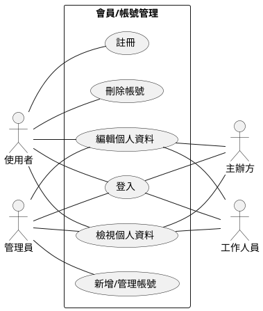

### 註冊流程
#### Activity Diagram
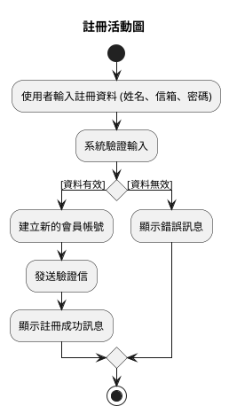
#### Sequence Diagram
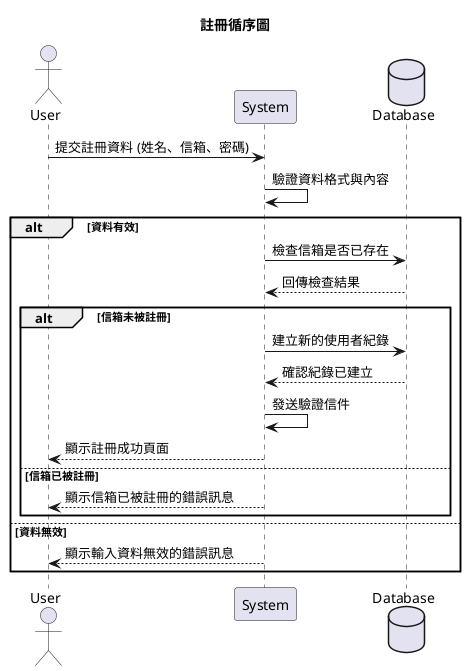

### 登入流程
#### Activity Diagram
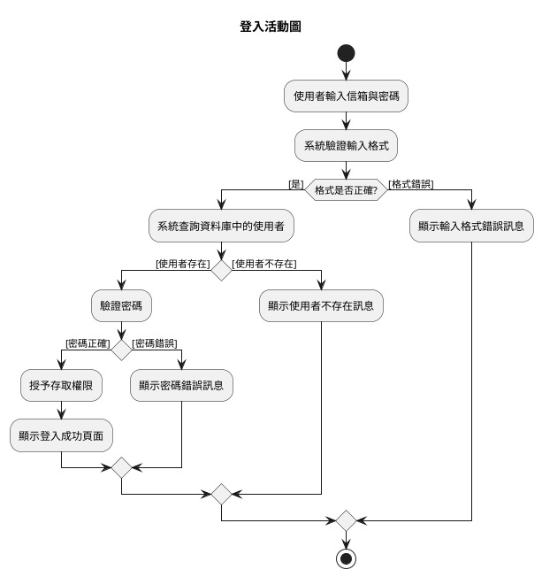
#### Sequence Diagram
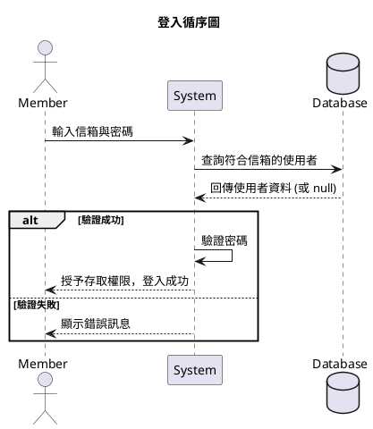

---

## 2. 場地與演唱會管理模組 (Venue and Concert Management Module)

### Use Case Diagram
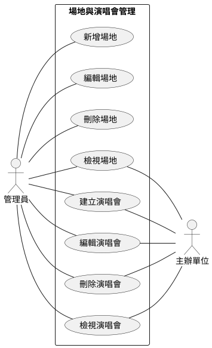

### 建立演唱會流程
#### Activity Diagram
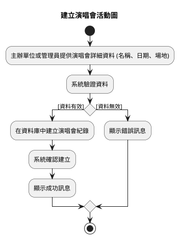
#### Sequence Diagram
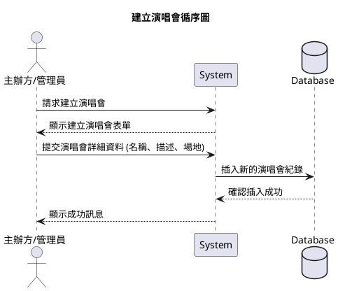

### 新增場地流程
#### Activity Diagram
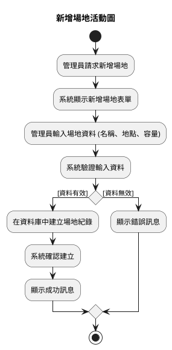
#### Sequence Diagram
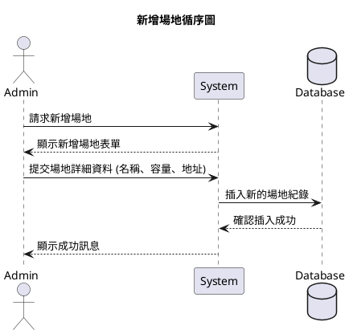

---

## 3. 場次與票種管理模組 (Event and Ticket Type Management Module)

### Use Case Diagram
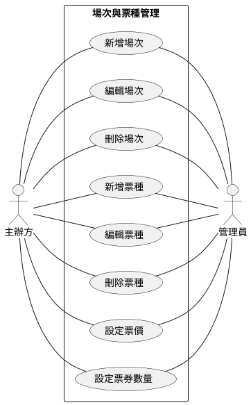

### 新增場次流程
#### Activity Diagram
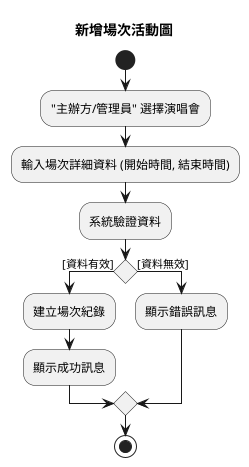
#### Sequence Diagram
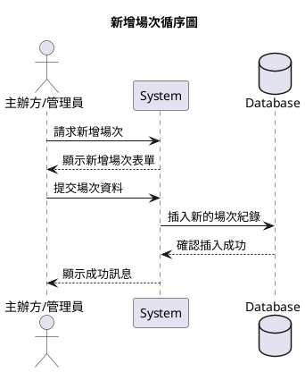

### 新增票種流程
#### Activity Diagram
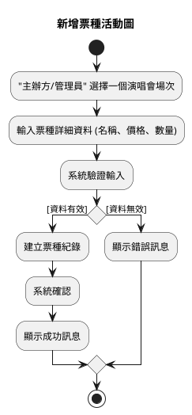
#### Sequence Diagram
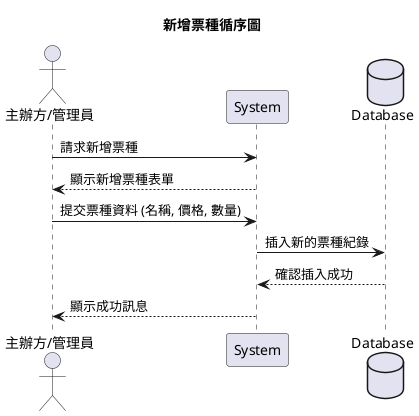

### 設定票價流程
#### Activity Diagram
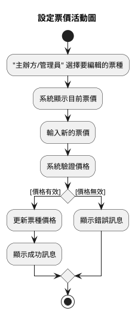
#### Sequence Diagram
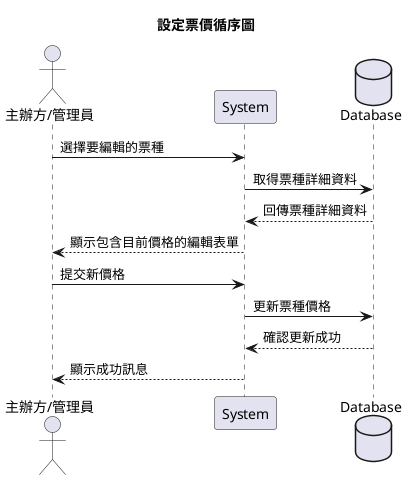

---

## 4. 訂單與票劵管理模組 (Order and Ticket Management Module)

### Use Case Diagram
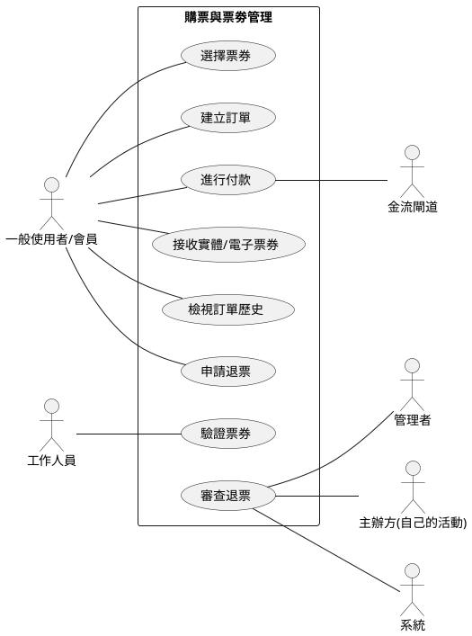

### 購票流程
#### Activity Diagram
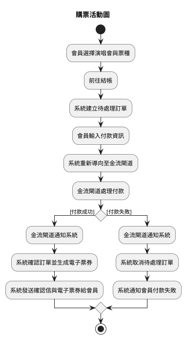
#### Sequence Diagram
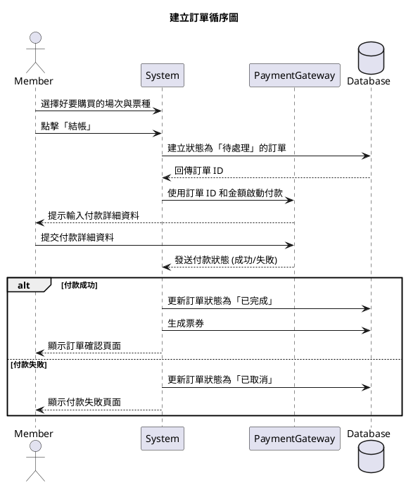

### 取消訂單/退票流程
#### Activity Diagram
```plantuml
@startuml activity
title 退票活動圖

start

:會員請求退票訂單;
:系統檢查票種狀態與取消政策;

if (允許取消?) then ([是])

  :檢查是否在可自動退票時限內;

  if (在自動退票時限內?) then ([是])
    :更新訂單狀態為「已取消」;
    :處理退款 (如果適用);
    :發送取消確認通知;
    :顯示取消成功訊息;
  else ([超過自動退票時限])
    :將退票申請送審至管理員／主辦方;
    :管理員／主辦方審查退票;
    if (審查通過?) then ([是])
      :更新訂單狀態為「已取消」;
      :處理退款 (如果適用);
      :發送取消確認通知;
      :顯示取消成功訊息;
    else ([審查不通過])
      :顯示退票申請被拒絕訊息;
    endif
  endif

else ([否])
  :顯示無法取消的訊息;
endif

stop

@enduml
```
#### Sequence Diagram
```plantuml
@startuml
title 取消訂單循序圖
actor Member
participant System
database Database
participant PaymentGateway

Member -> System: 請求取消訂單
System -> Database: 查詢訂單狀態
Database --> System: 回傳訂單狀態
alt 訂單可取消
    System -> Database: 更新訂單狀態為「已取消」
    Database --> System: 確認更新
    System -> PaymentGateway: (如果已付款) 請求退款
    PaymentGateway --> System: 回傳退款狀態
    System --> Member: 顯示取消成功並通知退款
else 訂單不可取消
    System --> Member: 顯示無法取消訊息
end
@enduml
```

### 驗證票券流程
#### Activity Diagram
```plantuml
@startuml
title 驗證票券活動圖
actor Staff
start
:工作人員使用裝置掃描票券 QR Code;
:系統接收 QR Code 資料;
:系統查詢票券狀態;
if () then ([票券有效])
  :更新票券狀態為「已使用」;
  :顯示驗證成功訊息;
else ([票券無效或已使用])
  :顯示驗證失敗訊息 (例如: 無效、已使用);
endif
stop
@enduml
```
#### Sequence Diagram
```plantuml
@startuml
title 驗證票券循序圖
actor Staff
participant System
database Database

Staff -> System: 掃描票券 QR Code
System -> Database: 查詢票券狀態
Database --> System: 回傳票券狀態
alt 票券有效
    System -> Database: 更新票券狀態為「已使用」
    Database --> System: 確認更新
    System --> Staff: 顯示驗證成功訊息
else 票券無效
    System --> Staff: 顯示驗證失敗訊息
end
@enduml
```

---

## 會員管理模組 類別圖
```plantuml
@startuml
skinparam linetype polyline
class Member {
  - id: String
  - name: String
  - email: String
  - password: String
  - phone: String
  - status: String
  + register()
  + login()
  + editProfile()
  + deleteAccount()
}

class Admin {
  - id: String
  - name: String
  - email: String
  - password: String
  + manageUsers()
  + login()
}

class Organizer {
  - id: String
  - name: String
  - email: String
  - password: String
  + manageConcerts()
}

class Staff {
  - id: String
  - name: String
  - email: String
  - password: String
  + verifyTicket()
}

Member <|-- Admin
Member <|-- Organizer
Member <|-- Staff
@enduml
```

---

## 場地與演唱會管理模組 類別圖
```plantuml
@startuml
skinparam linetype ortho
class Admin {
  +id: int
  +name: String
  +email: String
  +權限: String
}

class Organizer {
  +id: int
  +name: String
  +organization: String
  +email: String
}

class Venue {
  +id: int
  +name: String
  +location: String
  +capacity: int
  +status: String
}

class Concert {
  +id: int
  +name: String
  +description: String
  +date: Date
  +status: String
}

' 關聯
Organizer "1" --> "0..*" Concert : 建立
Admin "1" --> "0..*" Venue : 管理
Venue "1" <-- "1" Concert : 使用
Admin "1" --> "0..*" Concert : 審查或協助

@enduml

```

---

## 場次與票種管理模組 類別圖
```plantuml
@startuml
skinparam linetype ortho
title 場次與票種管理模組 - 類別圖

class Concert {
  +id: int
  +name: String
  +description: String
  +date: Date
  +status: String
}

class EventSession {
  +id: int
  +concertId: int
  +startTime: DateTime
  +endTime: DateTime
  +status: String
}

class TicketType {
  +id: int
  +eventSessionId: int
  +name: String
  +price: float
  +quantity: int
  +status: String
}

class Admin {
  +id: int
  +name: String
  +email: String
}

class Organizer {
  +id: int
  +name: String
  +organization: String
  +email: String
}

' 關聯
Concert "1" --> "0..*" EventSession : 包含場次
EventSession "1" --> "0..*" TicketType : 包含票種
Organizer "1" --> "0..*" EventSession : 建立
Admin "1" --> "0..*" EventSession : 管理
Organizer "1" --> "0..*" TicketType : 設定
Admin "1" --> "0..*" TicketType : 調整/審核

@enduml

```

---

## 購票與票劵管理模組 類別圖
```plantuml
@startuml
skinparam linetype ortho
' === 主要類別 ===
class Member {
  +id: int
  +name: String
  +email: String
}

class Admin {
  +id: int
  +name: String
}

class Organizer {
  +id: int
  +name: String
  +organization: String
}

class EventSession {
  +id: int
  +concertId: int
  +startTime: DateTime
  +endTime: DateTime
}

class TicketType {
  +id: int
  +eventSessionId: int
  +name: String
  +price: float
  +quantity: int
}

class Order {
  +id: int
  +memberId: int
  +status: String
  +paymentStatus: String
  +createdAt: DateTime
}

class Ticket {
  +id: int
  +orderId: int
  +ticketTypeId: int
  +qrCode: String
  +status: String
}

' === 系統應用邏輯核心 ===
class System {
  +createOrder()
  +generateTicket()
  +validateQRCode()
  +checkAutoRefundEligibility()
  +submitRefundReview()
}

' === 外部服務 ===
class PaymentGateway <<external>> {
  +processPayment()
  +refund()
}

note right of PaymentGateway
金流服務商（例如Line、信用卡）
end note

note right of System
系統核心邏輯：負責處理訂單、
退票條件判斷、票券驗證與生成
end note

' === 關聯 ===
Member "1" --> "0..*" Order : 建立
Order "1" --> "1..*" Ticket : 包含
Ticket "1" --> "1" TicketType : 對應票種
TicketType "1" --> "1" EventSession : 屬於場次
EventSession "1" --> "0..*" Order : 購票來源
Organizer "1" --> "0..*" TicketType : 設定
Admin "1" --> "0..*" Order : 審查退票
Organizer "1" --> "0..*" Order : 審查退票

' 系統行為與邏輯依賴（非資料儲存）
System ..> PaymentGateway : 呼叫付款/退款 API
System ..> Order : 建立與更新
System ..> Ticket : 建立與驗證
System ..> TicketType : 讀取價格/數量
System ..> EventSession : 判斷退票時限

@enduml


```

